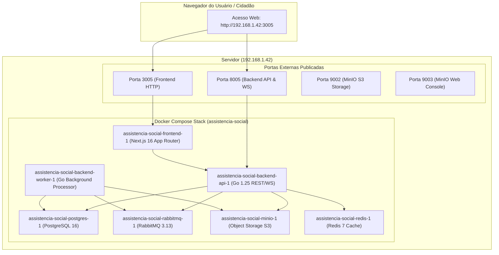

# Documentação Técnica e Operacional: Portal da Assistência Social (SEMPRAS)

> **Prefeitura Municipal de Rondonópolis — MT**  
> **Secretaria Municipal de Promoção e Assistência Social (SEMPRAS)**  
> **Servidor de Produção/Homologação:** `192.168.1.42`  
> **Porta do Portal Web (Frontend):** `3005`  
> **Porta da API REST / WebSocket (Backend):** `8005`  
> **Data de Homologação e Deploy:** Setembro de 2026

---

## 1. Visão Geral do Sistema

O **Portal da Assistência Social** é uma plataforma corporativa modular de alta disponibilidade e conformidade governamental (SGD/MGI, e-MAG 2.0, DSGov, LGPD e OWASP). Desenvolvida sob o padrão de **Arquitetura Microkernel**, a plataforma atende diretamente à rede socioassistencial do município de Rondonópolis, unificando canais de atendimento, catálogo público de serviços ao cidadão e ferramentas administrativas.

O projeto foi totalmente reestruturado e renomeado para **Assistência Social**, eliminando qualquer denominação legada (*Projeto Aurora* ou *Projeto Aurora v3*).

---

## 2. Acesso e Credenciais de Teste

Para realizar testes funcionais no ambiente:

- **Endereço da Aplicação Web:** [http://192.168.1.42:3005](http://192.168.1.42:3005)
- **Tela de Login Administrativo:** [http://192.168.1.42:3005/login](http://192.168.1.42:3005/login)
- **Usuário:** `admin`
- **Senha:** `Admin@2026`
- **Perfil de Acesso:** Administrador Geral (acesso completo a Configurações, Monitoramento, Auditoria, Trâmite, Módulos e Gerenciamento de Serviços).

---

## 3. Topologia de Infraestrutura e Containers

A stack é executada sob o projeto Docker Compose **`assistencia-social`** no servidor `192.168.1.42`, coexistindo de forma isolada com o *Protocolo Digital*:



### 3.1. Mapeamento de Portas e Endpoints

| Container | Porta Host | Porta Container | Descrição |
| :--- | :--- | :--- | :--- |
| **`assistencia-social-frontend-1`** | **`3005`** | `3000` | Portal público e painel administrativo |
| **`assistencia-social-backend-api-1`** | **`8005`** | `8005` | API REST Go e Handshake WebSocket (`/ws`) |
| **`assistencia-social-minio-1`** | **`9002`** | `9000` | Armazenamento de arquivos e anexos via S3 |
| **`assistencia-social-minio-1`** | **`9003`** | `9001` | Painel web de administração dos buckets S3 |
| **`assistencia-social-postgres-1`** | *Interna* | `5432` | Banco relacional na rede `assistencia_internal` |
| **`assistencia-social-rabbitmq-1`** | *Interna* | `5672` / `15672` | Mensageria assíncrona e Outbox Transacional |
| **`assistencia-social-redis-1`** | *Interna* | `6379` | Cache e sessões em tempo real |

---

## 4. Catálogo de Programas e Unidades da Assistência Social

O catálogo oficial de serviços da SEMPRAS exibido na home pública e gerenciável em `/servicos/gerenciar`:

| # | Unidade / Serviço | Categoria | Descrição |
| :---: | :--- | :--- | :--- |
| **01** | **CRAS — Centro de Referência de Assistência Social** | Proteção Básica | Porta de entrada dos serviços socioassistenciais municipais, CadÚnico, Bolsa Família e fortalecimento de vínculos familiares. |
| **02** | **CREAS — Proteção Social Especial** | Média Complexidade | Atendimento especializado a indivíduos e famílias em situação de risco ou com direitos violados (PAEFI). |
| **03** | **Centro POP & Abordagem Social** | População de Rua | Acolhimento diurno, alimentação, higienização, documentação civil e reinserção comunitária. |
| **04** | **Casa da Mulher** | Proteção à Mulher | Espaço seguro de acolhimento psicossocial e suporte jurídico para mulheres vítimas de violência doméstica. |
| **05** | **Cadastro Único & Bolsa Família** | Transferência de Renda | Inscrição e atualização socioeconômica para acesso a mais de 30 programas sociais (Bolsa Família, BPC, etc.). |
| **06** | **Benefícios Eventuais e Auxílios** | Assistência Emergencial | Concessão de auxílio natalidade, funeral, cestas de alimentos e apoio emergencial em contingências. |
| **07** | **Conselho Tutelar (Central e Vila Operária)** | Garantia de Direitos | Plantão 24h e atuação contínua para zelar pelos direitos fundamentais da criança e do adolescente. |
| **08** | **SCFV — Serviço de Convivência** | Convivência | Oficinas artísticas, culturais e esportivas nos núcleos Padre Lothar e Vila Olímpica para jovens e idosos. |
| **09** | **Casa Abrigo Municipal** | Alta Complexidade | Acolhimento provisório 24h com proteção integral para crianças e adolescentes em situação de risco. |

---

## 5. Diretórios e Comandos Operacionais

### 5.1. Caminho de Trabalho no Servidor
- Diretório canônico: `/root/Projetos/assistencia-social`
- Link simbólico administrativo: `/opt/assistencia-social`

### 5.2. Comandos do Docker Compose
```bash
cd /opt/assistencia-social

# Verificar status dos containers
docker compose ps

# Logs em tempo real do frontend
docker compose logs -f frontend

# Logs em tempo real do backend
docker compose logs -f backend-api

# Reiniciar serviços
docker compose restart frontend backend-api

# Atualizar containers
docker compose up -d --build
```
