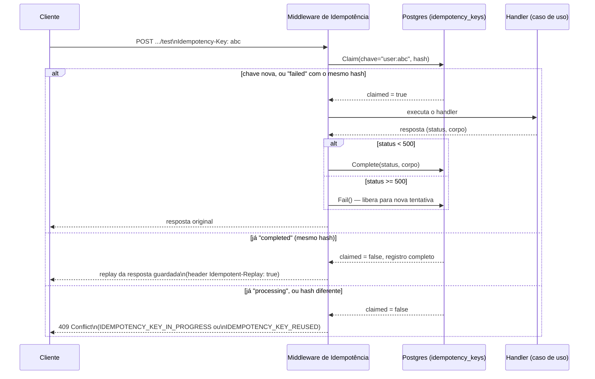
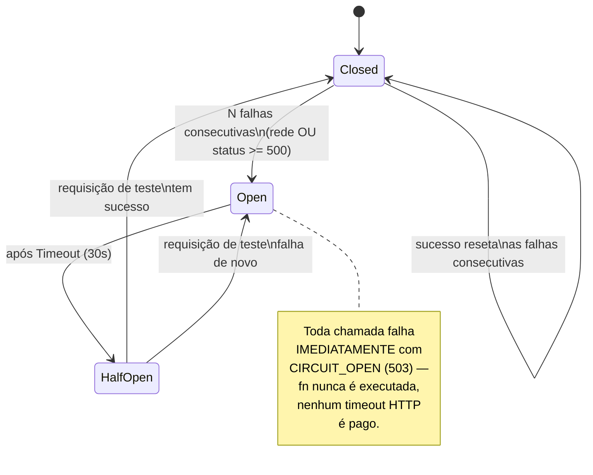
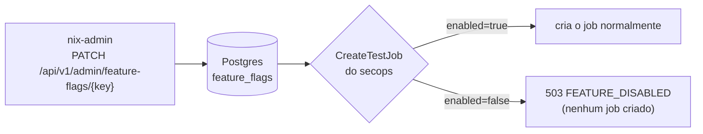
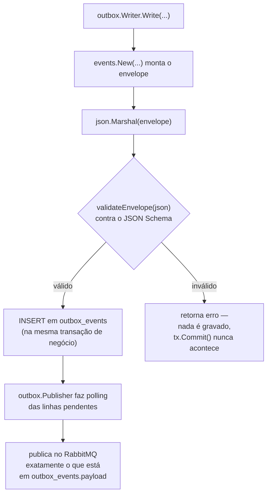

# 002 — Resiliência e governança de nível enterprise

- **Status:** Aceito
- **Data:** 2026-08-22
- **Autores:** Engenharia NIX Platform

## Contexto

O NIX Platform (monólito modular Go + Next.js, PostgreSQL + RabbitMQ com
outbox transacional) já cobria autenticação/autorização, mensageria com
retry/DLQ, rate limiting distribuído, auditoria imutável e observabilidade
básica. Quatro lacunas continuavam expostas conforme a plataforma se
aproximava de um perfil de produção enterprise:

1. **Sem idempotência.** Um duplo clique no botão "Testar" do dashboard,
   ou um retry automático de um cliente HTTP após um timeout de rede,
   criava dois jobs em vez de um — cada um gerando seu próprio evento de
   outbox, sua própria chamada ao provedor externo, sua própria
   notificação.
2. **Sem circuit breaker.** Se um provedor externo como o VirusTotal
   começasse a falhar ou a responder devagar, cada nova tentativa ainda
   pagava o timeout HTTP inteiro (§48) antes de desistir — sob volume,
   isso segura workers/goroutines e insiste contra um provedor que já se
   mostrou indisponível, adiando a recuperação dele.
3. **Sem interruptor de emergência.** Desligar uma integração problemática
   (ex.: um provedor externo instável, ou uma chave de API revogada)
   exigia alterar configuração e reimplantar tanto `cmd/api` quanto
   `cmd/worker`.
4. **Sem validação de schema no outbox.** `outbox_events.payload` é
   `JSONB` sem constraint alguma no banco — um bug futuro em qualquer
   caminho que escreva ali (não só `outbox.Writer`) poderia gravar, e o
   `Publisher` então publicar no RabbitMQ, um evento fora do contrato
   padrão (§17), quebrando silenciosamente todo consumer que espera o
   formato `{id, type, version, source, occurred_at, correlation_id,
   payload}`.

## Decisão

Implementar quatro capacidades de plataforma, cada uma como um pacote
novo em `backend/internal/platform/`, seguindo o mesmo padrão já
estabelecido pelos pacotes existentes (`ratelimit`, `audit`, `outbox`):
sem dependência de Redis (decisão arquitetural §7 mantida — tudo
compartilhado via PostgreSQL), testável sem infraestrutura sempre que a
lógica permitir, e conectado uma única vez em `internal/app`.

### A. Idempotency Key Middleware — `internal/platform/idempotency`

Um middleware HTTP opt-in por requisição: só age quando o cliente envia o
header `Idempotency-Key`. A chave é escopada por usuário autenticado
(`subject:chave`) para eliminar colisão entre usuários diferentes, e
acompanhada de um hash do corpo da requisição para detectar reuso indevido
da mesma chave com um payload diferente.

**Atomicidade da reivindicação (Claim).** A decisão "esta chamada ganhou
o direito de processar" precisa ser atômica sob concorrência — duas
requisições com a mesma chave nova, chegando ao mesmo tempo, não podem
ambas se achar "a primeira". `PostgresStore.Claim` resolve isso com uma
única instrução SQL: uma CTE de escrita (`INSERT ... ON CONFLICT DO
UPDATE ... WHERE status = 'failed' AND request_hash = EXCLUDED.request_hash
RETURNING ...`) seguida de um `SELECT` de fallback que só roda se a
primeira parte não afetou nenhuma linha. Isso cobre três casos numa única
viagem ao banco:

- **Chave nunca vista** → o `INSERT` simples ganha, `claimed = true`.
- **Chave `failed` com o MESMO hash** → o `UPDATE` reabre a chave para
  `processing`, `claimed = true` — um erro de servidor não pode travar a
  chave para sempre; o cliente pode tentar de novo esperando um resultado
  diferente.
- **Qualquer outro caso** (`processing`, `completed`, ou `failed` com um
  hash diferente) → nem o `INSERT` nem o `UPDATE` disparam, e o `SELECT`
  de fallback devolve o registro tal como está, para o middleware decidir
  entre replay, 409 de conflito, ou rejeição por reuso indevido.

**Por que 500 libera a chave, mas < 500 não.** Um erro de servidor
(500) é, por definição, um resultado que o cliente não deveria "confiar"
como definitivo — ele pode (e deve poder) tentar de novo. Já uma resposta
de sucesso ou de erro do cliente (4xx) é o resultado definitivo daquela
requisição: reexecutá-la criaria o job duplicado que a idempotência existe
para prevenir. Por isso `finalizeClaim` chama `Fail` (libera) só para
`status >= 500`, e `Complete` (guarda para replay) para tudo abaixo disso.

**Por que não interceptar toda requisição incondicionalmente.** O
middleware é montado uma única vez em `/api/v1` (depois de
`RequireAuthentication`, já que a chave precisa da identidade), mas só
tem efeito quando o header está presente — nenhuma rota paga custo algum
por padrão, e nenhuma mudança é necessária em `routes.go` de módulo
nenhum para uma rota nova ganhar suporte a idempotência.

### B. Circuit Breaker — `internal/platform/resilience`

Construído sobre `github.com/sony/gobreaker/v2` (genérico — `Breaker[T]`
com `T = *http.Response`), aplicado ao `Client` do VirusTotal e a outros
clientes HTTP de provedores externos.

O status HTTP (>= 500) é verificado **dentro** do callback passado a
`Execute`, não depois — assim tanto uma falha de rede (`client.Do`
retornando erro) quanto um provedor respondendo consistentemente com erro
de servidor contam como falha para o breaker. Um 4xx (ex.: 401 de API key
inválida, 404) não conta: é uma resposta HTTP válida que os clientes já
sabiam interpretar como um erro específico de domínio, não como "o
provedor está fora do ar" — contar 4xx abriria o circuito por um problema
de configuração (uma chave de API errada), não de disponibilidade.

Toda transição de estado atualiza `nix_circuit_breaker_state{name=...}`
(0=closed, 1=half-open, 2=open) e incrementa
`nix_circuit_breaker_transitions_total{name,from,to}`, além de gerar uma
linha de log — dá visibilidade operacional sem precisar consultar o
estado ativamente.

**Por que não usar um circuit breaker compartilhado/distribuído.** Cada
processo (réplica da API, réplica do worker) mantém seu próprio breaker
em memória, por provedor. Um breaker compartilhado via Postgres
exigiria uma escrita por requisição só para atualizar contadores — o
mesmo custo que motivou o design sem-cache do rate limiting, mas aqui sem
o mesmo benefício: um breaker por processo ainda protege o provedor
externo (a soma das réplicas nunca excede muito o tráfego real), e a
janela de "réplicas divergindo sobre se o circuito está aberto" é curta
(o `Timeout` é de segundos) e sem consequência grave — na pior hipótese,
uma réplica tenta uma requisição a mais contra um provedor que outra já
identificou como fora do ar.

### C. Feature Flags — `internal/platform/configflags`

Uma tabela (`feature_flags`) com um `Store` fino por cima: `IsEnabled`,
`List`, `Set`. **Deliberadamente sem cache em memória** — cada checagem
consulta o Postgres diretamente, no mesmo espírito de
`ratelimit.PostgresLimiter`. A alternativa (cache local com TTL, ou
invalidação via LISTEN/NOTIFY) foi descartada: como toda checagem de flag
acontece imediatamente antes de uma chamada de rede a um provedor externo
— nunca em todo request HTTP —, o custo extra de um `SELECT` por chave
primária é irrelevante frente à própria latência de rede que a flag está
decidindo se autoriza. Em troca, ganha-se uma propriedade valiosa para um
interruptor de emergência: **a mudança feita pelo administrador vale
imediatamente em toda réplica**, sem janela de propagação.

A chave de flag do módulo SecOps é derivada do próprio `providerKey`
(`secops_<provider>_enabled`) em vez de fixa — um provedor novo (Shodan,
AbuseIPDB, ...) já nasce com seu próprio interruptor sem precisar de
nenhuma mudança de código em `secops/application`, só uma linha na
migration/no admin de flags (mesmo princípio de extensibilidade de §36).

Restrito ao papel `nix-admin` via uma nova permissão dedicada
(`feature_flags:manage`) — deliberadamente **não** concedida a nenhum
outro papel em `rolePermissions`: alternar uma flag em produção afeta
todo mundo imediatamente, sem meio-termo por role.

`Service.flags` é opcional (`nil`-tolerante) nos serviços de aplicação
que usam esse padrão (ex.: `secops`) — quando `nil`, a checagem é pulada e a
funcionalidade correspondente é tratada como sempre habilitada. Isso
manteve toda a suíte de testes de aplicação já existente (que já roda
contra Postgres real, mas não se importa com feature flags) funcionando
sem precisar semear flag nenhuma para cada cenário de teste.

### D. Schema Validator do Outbox — `internal/platform/outbox` (`schema.go`)

Um JSON Schema (`envelope.schema.json`, embutido no binário via
`go:embed`) que descreve exatamente o contrato do §17: `id` e
`correlation_id` como UUID, `type` seguindo a convenção
`<contexto>.<entidade>.<ação>` (§9, via `pattern`), `version` inteiro
`>= 1`, `source`/`occurred_at` presentes com o tipo certo, `payload`
presente (sem restringir sua forma interna — cada tipo de evento tem seu
próprio payload), e `additionalProperties: false` — nenhum campo fora
desses sete é aceito.

A validação acontece **uma única vez**, em `Writer.Write`, contra o JSON
já serializado (não contra o `struct` Go em memória) — pega qualquer
divergência introduzida pela própria serialização, não só erros de
construção do `events.Event`. Como o `Publisher` (worker) só publica
exatamente o que está gravado em `outbox_events.payload`, garantir o
contrato no momento da escrita cobre transitivamente também a garantia de
que nada fora do contrato chega a ser publicado no RabbitMQ — não foi
necessário duplicar a validação no lado da publicação.

**Por que JSON Schema e não só a tipagem estática do Go.** O `struct
events.Event` já impõe a forma correta quando o código passa por
`events.New` — mas essa garantia depende de todo caminho de escrita
continuar passando por ali. Um JSON Schema validado no ponto de inserção
é uma segunda camada independente da primeira: pega tanto um bug em
`events.New`/`Writer.Write` quanto, no futuro, qualquer código que venha
a montar um envelope por fora desse caminho (ex.: uma migração de dados,
um script de correção manual). O custo é uma validação a mais por evento
publicado — compilação do schema acontece uma única vez (`sync.Once`),
então o custo por chamada é só o de validar um documento JSON pequeno
contra um schema já compilado.

## Consequências

**Positivas**

- Duplo clique / retry automático do cliente não cria mais jobs
  duplicados nos dois endpoints de teste de integração.
- Um provedor externo instável não consegue mais degradar a plataforma
  inteira (workers presos em timeouts repetidos) — o circuit breaker
  falha rápido depois de `DefaultConsecutiveFailures` (5) falhas
  seguidas.
- Uma integração problemática pode ser desligada por um `nix-admin` em
  segundos, sem deploy, através de `PATCH /api/v1/admin/feature-flags/{key}`.
- Um evento fora do contrato padrão nunca chega a ser gravado no outbox
  nem publicado no RabbitMQ, não importa qual caminho de código o gerou.
- Toda nova capacidade é observável via Prometheus
  (`nix_idempotency_outcomes_total`, `nix_circuit_breaker_state`,
  `nix_circuit_breaker_transitions_total`, `nix_feature_flag_checks_total`)
  e testável sem depender de infraestrutura viva onde a lógica permite
  (`middleware_test.go` do idempotency e `circuitbreaker_test.go` do
  resilience usam só implementações falsas/em memória).

**Custos e trade-offs assumidos**

- `CreateTestJob` de `secops` ganhou um parâmetro a mais
  no construtor (`flags configflags.Store`) — mitigado por ser
  `nil`-tolerante, então nenhum teste existente precisou de mudança além
  de passar `nil` no lugar.
- O circuit breaker é por processo, não compartilhado entre réplicas
  (ver justificativa na seção C) — aceito como trade-off correto para
  este caso de uso.
- A tabela `idempotency_keys` cresce com o tráfego; mitigado por
  `idempotency.Cleanup`, um processor do worker (mesmo padrão de
  `ratelimit.Cleanup`) que apaga chaves com mais de 24h.
- Buffer de resposta em memória no middleware de idempotência
  (`MaxCachedResponseBytes = 64 KiB`) — adequado para os envelopes JSON
  pequenos que os endpoints atuais retornam; uma resposta maior no futuro
  ainda funciona (o cliente a recebe normalmente), só não fica disponível
  para replay.

## Extensão futura

- Um novo endpoint de escrita ganha idempotência automaticamente ao
  aceitar o header `Idempotency-Key` — nenhuma mudança de código além de
  documentá-lo no OpenAPI.
- Um novo provedor SecOps (Shodan, AbuseIPDB, ...) já nasce com circuit
  breaker (basta usar `resilience.New` no cliente) e feature flag
  (`secops_<provider>_enabled` é derivada automaticamente) sem tocar em
  `secops/application`.
- Payloads de evento por tipo poderiam ganhar seus próprios sub-schemas
  JSON Schema (referenciados a partir de `envelope.schema.json` via
  `$ref` condicionado a `type`), se a plataforma precisar validar não só
  o envelope mas a forma de cada payload — deixado como não feito por
  falta de um caso de uso concreto que o justifique hoje, no mesmo
  espírito do §76.
