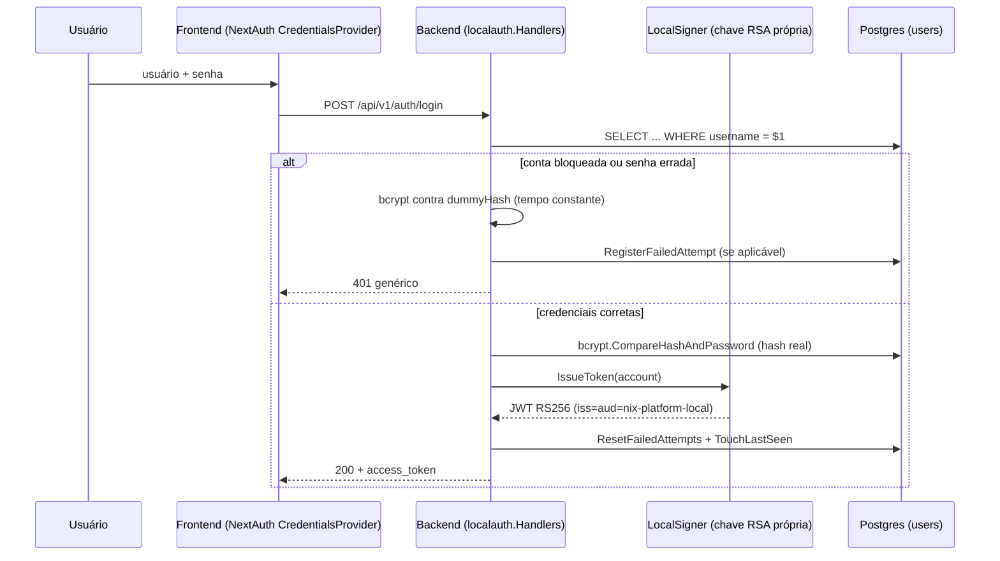

# 003 — Login local: assinatura RSA e bloqueio de conta

- **Status:** Aceito
- **Data:** 2026-08-23
- **Autores:** Engenharia NIX Platform

## Contexto

O login local (usuário/senha, adicional ao Keycloak — ver a migration
`000011_local_auth.sql` e `internal/platform/localauth`) foi implementado
inicialmente assinando seus próprios tokens com HS256 e um segredo
simétrico (`LOCAL_AUTH_JWT_SECRET`). Dois problemas concretos motivaram
esta revisão:

1. **Assinatura simétrica não é o padrão esperado para um subsistema de
   autenticação isolado.** Um segredo HS256 precisa ser conhecido por
   quem assina E por quem verifica — no NIX Platform os dois papéis
   sempre foram o mesmo processo backend, então isso nunca foi uma falha
   de design por si só, mas RSA (assinatura assimétrica) é o padrão que
   qualquer pessoa auditando este subsistema esperaria encontrar, e torna
   estruturalmente impossível confundir "a chave que assina tokens locais"
   com qualquer segredo simétrico usado em outro lugar da aplicação — um
   requisito explícito: o login local precisa permanecer criptografi-
   camente independente do Keycloak/SSO.
2. **Só havia rate limiting por IP contra força bruta de senha.** Um
   atacante distribuído (múltiplos IPs/proxies, ou uma botnet) sempre
   conseguiria contornar um limite por IP; nada impedia tentativas
   ilimitadas contra uma conta específica vindas de origens diferentes.

## Decisão

### A. RS256 com chave própria — `internal/platform/auth/local.go`

`LocalSigner` substitui as antigas funções `IssueLocalToken`/
`verifyLocalToken` (que recebiam `config.LocalAuthConfig` bruta a cada
chamada) por um tipo construído **uma única vez** no bootstrap
(`internal/app/dependencies.go`), a partir de `LOCAL_AUTH_PRIVATE_KEY`
(PEM RSA — PKCS1 ou PKCS8, tipicamente entregue via
`LOCAL_AUTH_PRIVATE_KEY_FILE`, o mesmo padrão `<KEY>_FILE` já usado para
todo segredo desta aplicação). A chave pública nunca é configurada
separadamente — é sempre derivada da privada (`privateKey.Public()`).

Regras aplicadas na assinatura/verificação (`local.go`):

- Algoritmo travado em RS256 (`jwt.WithValidMethods([]string{"RS256"})`)
  — um token HS256 ou um token RS256 de outra chave (por exemplo, um
  token de verdade do Keycloak) nunca passa por acidente.
- `iss` e `aud` = `nix-platform-local`, verificados explicitamente
  (`jwt.WithIssuer`/`jwt.WithAudience`) — mesma rigor que o caminho
  Keycloak já tem via `go-oidc`.
- Chave mínima de 2048 bits, rejeitada no startup (`NewLocalSigner`) se
  menor — falha rápido, igual a toda outra validação de configuração
  desta aplicação.
- **Sem endpoint JWKS**: a verificação de um token local nunca cruza um
  processo diferente do que o assinou (ao contrário do Keycloak, cujos
  tokens podem ser verificados por qualquer serviço que baixe o JWKS do
  realm) — um par de chaves estático é suficiente e apropriado para este
  escopo; publicar um JWKS aqui seria complexidade sem propósito.

### B. Bloqueio de conta — `internal/platform/localauth`

Migration `000012_local_auth_lockout.sql` adiciona
`failed_login_attempts`/`locked_until` a `users`. Política fixa (não
configurável por env var — YAGNI até que algum ambiente real precise de
um valor diferente):

| Parâmetro | Valor |
|---|---|
| Tentativas até bloquear | 5 |
| Duração do bloqueio | 15 minutos |

`Store.RegisterFailedAttempt` incrementa o contador e carimba
`locked_until` numa única instrução SQL (`UPDATE ... CASE WHEN ...`),
evitando uma corrida entre duas tentativas de login concorrentes contra a
mesma conta. `ResetFailedAttempts` roda em todo login bem-sucedido.

**Mitigação de canal lateral por temporização:** o handler roda
`bcrypt.CompareHashAndPassword` contra um `dummyHash` fixo em todo caminho
de rejeição que não seja "senha errada de verdade" (usuário inexistente,
conta inativa, conta bloqueada) — sem isso, uma conta bloqueada
responderia mais rápido que uma tentativa de senha comum (pula o bcrypt
contra o hash real), o que por si só revelaria a um atacante que aquela
conta existe e está bloqueada, mesmo a resposta HTTP sendo idêntica byte a
byte.

### C. `Cache-Control: no-store`

A resposta de login carrega um bearer token — nunca deve ficar em cache
de disco do navegador nem em nenhum proxy/CDN intermediário. Aplicado
tanto na resposta de sucesso quanto na de erro.

## Consequências

**Positivas:**
- Login local criptograficamente independente do Keycloak — nenhum
  segredo compartilhado entre os dois caminhos de autenticação.
- Defesa em profundidade real contra força bruta (IP + conta), não só um
  rate limit por IP contornável por qualquer atacante distribuído.
- Superfície de configuração mais simples: um `*LocalSigner` nil substitui
  a checagem separada de `cfg.Enabled` em `Verifier` e em
  `localauth.Handlers` — uma única fonte de verdade sobre "login local
  está ligado".

**Trade-offs aceitos:**
- Rotação de chave é manual (gerar um novo par, atualizar
  `LOCAL_AUTH_PRIVATE_KEY_FILE`, reiniciar) — todo token local emitido
  antes da rotação para de validar imediatamente. Aceitável dado o TTL
  curto (1h por padrão) e o caso de uso (dev/teste/conta de emergência,
  não o caminho primário de autenticação da plataforma).
- O limiar de bloqueio (5 tentativas / 15 min) é fixo no código, não
  configurável por ambiente. Promovê-lo a variável de configuração é
  trivial se algum dia for necessário — não vale a complexidade agora.

## Extensão futura

- Uma rota administrativa para desbloquear uma conta manualmente (hoje só
  expira sozinha depois de `lockoutDuration`) seria um complemento natural
  quando/se um módulo de gestão de usuários locais existir.
- Um validador de política de senha (comprimento mínimo, classes de
  caractere) faz sentido no momento em que existir um endpoint que crie ou
  troque senhas locais — hoje a única senha local é semeada por migration,
  então não há chamador para essa validação ainda.
